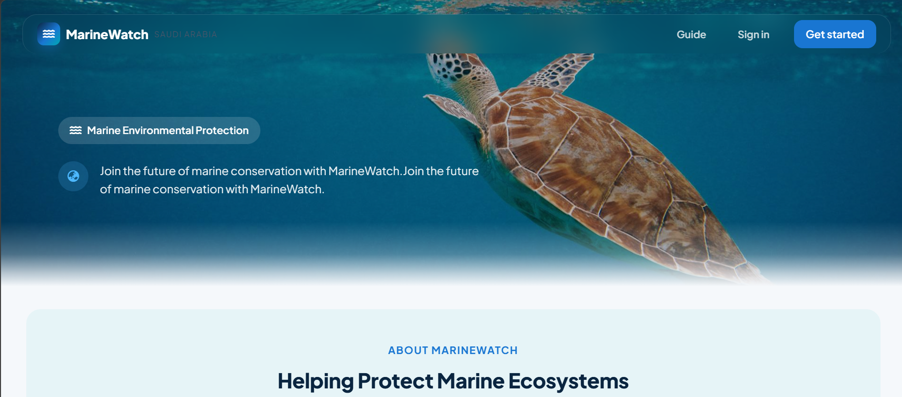
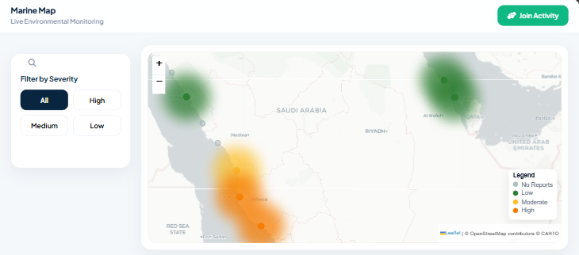
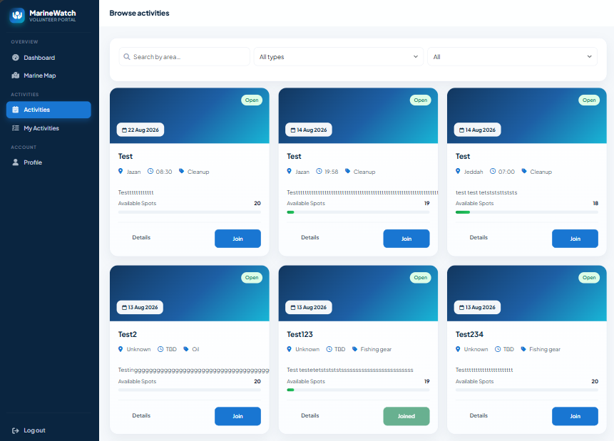
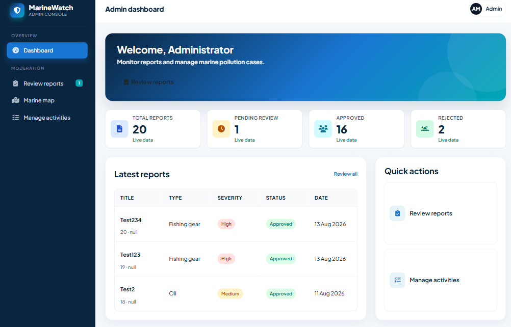
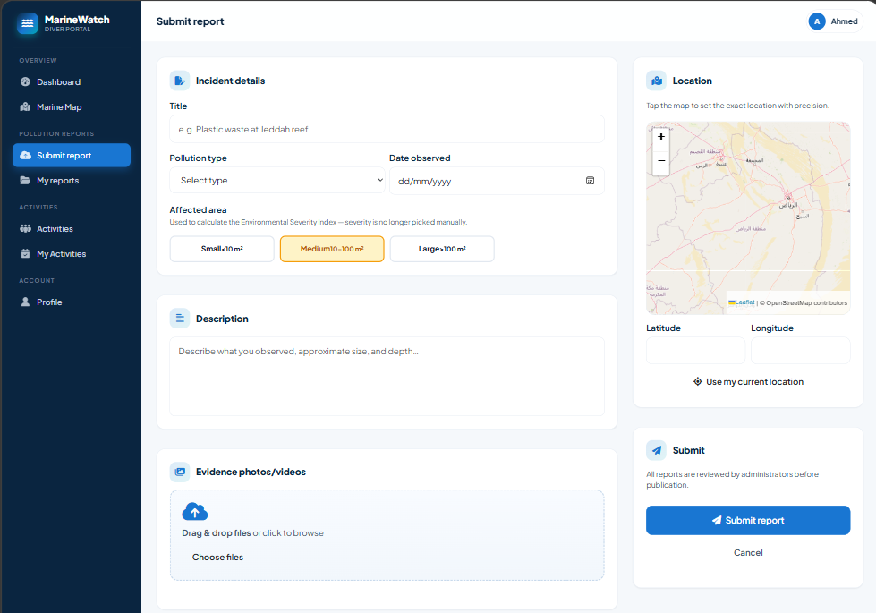

# MarineWatch

MarineWatch is a marine conservation platform for reporting pollution, coordinating volunteer activities, and helping environmental teams monitor affected areas across Saudi Arabia.

The project connects three roles in one workflow:

- **Divers** submit pollution reports with location, environmental details, and evidence photos.
- **Volunteers** browse and join marine cleanup activities.
- **Administrators** review reports, manage activities, and monitor system data.

## Portfolio Highlights

- Role-aware experiences for divers, volunteers, and administrators
- Pollution reporting with map location, date, affected area, and image uploads
- Leaflet-based marine monitoring map with severity filters and report/activity data
- Environmental Severity Index (ESI) calculated from pollution type and affected area
- Admin review workflow with report status and severity management
- Supabase Auth, database access, and Storage integration
- Responsive HTML, CSS, and JavaScript frontend with reusable navigation components
- Express REST API with authentication middleware and role-based access control

## Screenshots

### MarineWatch home page



### Marine monitoring map



### Volunteer activities



### Administrator dashboard



### Pollution report submission



## Technology Stack

**Frontend**

- HTML5, CSS3, and vanilla JavaScript
- Bootstrap 5.3
- Font Awesome
- Leaflet and Leaflet MarkerCluster
- Responsive layouts for public, diver, volunteer, and admin views

**Backend**

- Node.js and Express
- Supabase JavaScript client
- Supabase Auth for authentication
- Supabase database for profiles, reports, and activities
- Supabase Storage for report images
- Multer in-memory upload handling
- CORS and dotenv configuration

## Project Structure

```text
.
├── backend/
│   ├── config/          Supabase clients
│   ├── controllers/     Authentication, users, reports, and activities
│   ├── middleware/      Auth, roles, and upload handling
│   ├── models/          Database access functions
│   ├── routes/          Express API routes
│   ├── supabase/        Database migrations
│   ├── utils/           ESI and activity workflow helpers
│   └── server.js        Express application entrypoint
├── frontend/
│   ├── assets/          Images, icons, and logos
│   ├── css/             Page and responsive styles
│   ├── html/            Public, dashboard, report, and activity pages
│   └── js/              Page behavior and shared frontend utilities
└── screenshots/         Portfolio screenshots
```

## Core Workflows

### Pollution reporting

1. An authenticated diver opens the report form.
2. The diver selects a pollution type, observation date, affected area, and map location.
3. Evidence images can be uploaded with the report.
4. The backend calculates an ESI score and classifies the report as Low, Medium, or High.
5. Administrators review the report before it is published to the marine map.

### Volunteer activities

Visitors can browse activities by area, type, and status. Authenticated volunteers can join or leave activities and view their joined activities from the volunteer dashboard.

### Role-aware navigation

The shared frontend navigation resolves dashboard, profile, report, and activity links according to the signed-in user role. Backend middleware protects authenticated and administrator-only operations.

## Local Setup

### Prerequisites

- Node.js 18 or newer
- A Supabase project
- A modern browser

### Configure the backend

```powershell
cd backend
Copy-Item .env.example .env
```

Open `backend/.env` and fill in the values for your own Supabase project:

```env
PORT=3000
SUPABASE_URL=your_supabase_url_here
SUPABASE_ANON_KEY=your_supabase_anon_key_here
SUPABASE_SERVICE_ROLE_KEY=your_supabase_service_role_key_here
```

Keep `.env` private. It is ignored by Git and must never be committed. The service role key is server-only and must not be placed in frontend files.

Run the ESI migration once in the Supabase SQL editor:

```text
backend/supabase/migration_esi.sql
```

Install backend dependencies and start the API:

```powershell
npm install
npm start
```

The server exposes a health endpoint at `http://localhost:3000/api/health` when using the example port.

### Run the frontend

The frontend is a static site. Serve the repository through a local static server so its shared HTML components and scripts load correctly. For example, use the VS Code Live Server extension and open:

```text
frontend/index.html
```

The frontend API base URL defaults to the deployed MarineWatch API and can be overridden in the browser through the existing `mw_api_base_url` setting or by configuring the frontend deployment environment.

## API Overview

| Area | Example endpoints | Purpose |
| --- | --- | --- |
| Health | `GET /api/health` | Check API availability |
| Auth | `POST /api/auth/register`, `POST /api/auth/login` | Register and authenticate users |
| Reports | `POST /api/reports`, `GET /api/reports/map` | Create reports and retrieve map data |
| Activities | `GET /api/activities`, `POST /api/activities/:id/join` | Browse and join activities |
| Admin | `/api/admin/*` | Review reports and manage administrative workflows |
| Users | `GET /api/users`, `GET /api/users/role/:role` | Retrieve role-based profile data |

Authenticated requests use a Supabase session token in the `Authorization` header.

## Security Notes

- Never commit `backend/.env` or any other file containing credentials.
- `SUPABASE_SERVICE_ROLE_KEY` is used only by the backend and must remain private.
- Use `backend/.env.example` as the safe configuration template.
- Review Supabase Storage and Row Level Security policies before deploying a new environment.

## Project Status

MarineWatch is an academic/project portfolio application demonstrating a complete environmental reporting workflow from field submission to administrative review and volunteer action.
